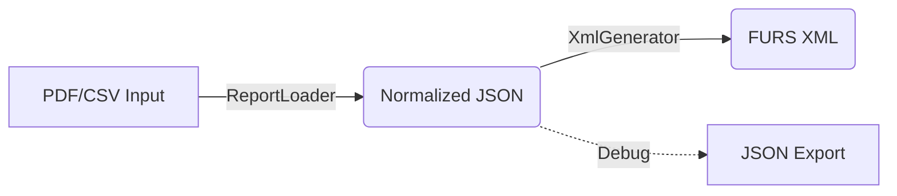

# 🏗️ Project Overview

**TaxBrokerReport** is built on a "Pipeline Architecture" designed to strictly separate parsing logic from tax generation logic. This ensures that as we add more brokers (Revolut, IBKR) or more tax forms, the system remains modular.

---

## 📐 Architecture Pipeline

The application data flow is linear and stateless:



### 1. Parsing Layer (ReportLoader)

Responsibility: Extracts raw text from PDFs (using poppler) and converts it into our internal "Normalized JSON" schema.

Key Design: It knows nothing about Slovenian taxes. It only knows how to read "Trade Republic" format.

### 2. Domain Layer (XmlGenerator)

Responsibility: Reads the Normalized JSON and maps it to specific FURS XML schemas (Doh-KDVP, Doh-Div, Doh-DHO).

Key Design: It knows nothing about PDF parsing. It simply trusts the input JSON.

### 3. Application Layer (ApplicationService)

Responsibility: The "Conductor". It accepts user configuration (Tax Year, Tax ID) and coordinates the Parser and Generator.

### 4. Presentation Layer (Qt6 GUI)

Responsibility: A "dumb" view. It never touches the logic directly; it only calls the ApplicationService.

## 📂 Logical Directory Structure

```Plaintext
TaxBrokerReport/
├── include/
│   ├── app/               # Application Service headers
│   ├── backend/           # Core logic (Parser + Generator)
│   ├──  gui/               # Qt Window definitions
|   └── util/              # Utility helpers (XML writers, Config)
├── src/
│   ├── app/               # Orchestration logic
│   ├── backend/           # The "Brains" (C++ logic)
│   ├── gui/               # The "Face" (Qt Widgets)
│   ├── main.cpp           # Entry point
|   └── util/              # Utility implementations
└──tests/                 # GoogleTest suites
```

## 🚀 Future Roadmap

Python Bindings: The backend folder is designed to be wrapped with pybind11 so data scientists can use import taxbroker in their scripts.