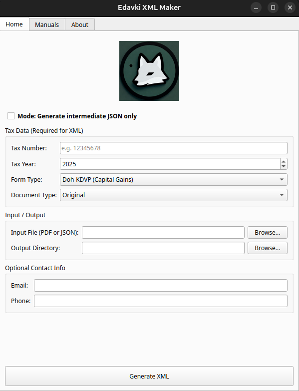
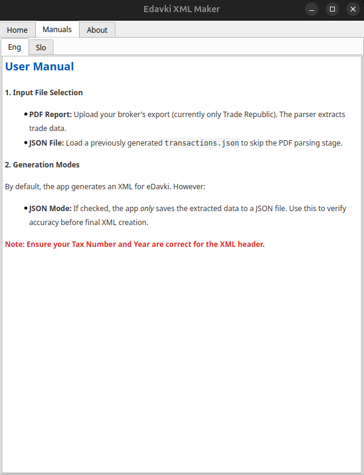

# App Usage Instructions

Follow these steps to transform your broker data into a FURS-compatible XML file using **TaxBrokerReport**.

---

## 1. Prepare your Input File

* Log in to your broker's platform (Trade Republic).
* **Get Tax Report**: On the mobile app, click your profile (upper right corner), select **Tax**, and download the **Annual Tax Report**.
* Save the PDF file to your computer.
* **Alternative (JSON)**: If you already have your data in the supported [JSON Format](data-format.md), you can use that instead of the PDF.

## 2. Load the Data

1. Launch the **TaxBrokerReport** application.
2. **Tax Data**:
    * Enter your **Tax Number** (Davčna številka).
    * Set the **Tax Year** (e.g., 2025).
3. **Form Selection**:
    * **Form Type**: Select the appropriate report (e.g., **Doh-KDVP** for Capital Gains).
    * **Document Type**: Usually **Original** (unless you are submitting a correction).
4. **Input Selection**:
    * Click the **"Browse..."** button next to **Input File**.
    * Select your downloaded Trade Republic PDF or your custom JSON file.
5. **Output Selection**:
    * Click the **"Browse..."** button next to **Output Directory**.
    * Select where to downloaded XML form file.

## 3. Configuration & Optional Info

* **JSON Mode**: If you only want to parse the PDF and extract the raw data, check **"Mode: Generate intermediate JSON only"**.
* **Optional Contact Info**: You may provide an Email or Phone number if you wish them to be included in the XML header for FURS contact purposes.

## 4. Generate the XML

1. Click the **"Generate XML"** button at the bottom.
2. The application will process the input and save the XML file to your selected output directory.
3. Check the application status bar (or pop-up) to ensure the process was successful.

---

## 🔒 Privacy & Security

* **Offline Processing**: This application does not require an internet connection to function.
* **No Data Collection**: Your financial data stays on your machine. No information is transmitted to the developer or any third party during this process.

---

## 🛠 Troubleshooting

* **PDF Parsing Issues**: Ensure you are using the official "Annual Tax Report" from Trade Republic. Other statements or order confirmations are not supported. As we have a limited number of sample tax reports for testing, parsing errors may occur on some specific layouts.
* **Tax Number**: Ensure you enter exactly 8 digits without any spaces or special characters.
* **Missing Transactions**: If transactions appear to be missing, verify that they occurred within the selected Tax Year.
* **Manual Corrections**: If the generated XML is incorrect, you can use the **JSON Mode** to download the raw data. You can then manually edit the JSON file and load it back into the app (instead of the PDF) to generate the final, corrected XML.

---

## 🖼️ Application Interface

Below is a screenshot of the main interface to help you identify the key fields:

* **Top Section**: Navigation tabs for Home, Manuals, and About.
* **Middle Section**: Tax data entry and file selection.
* **Bottom Section**: The "Generate XML" action button.

---

## ⚖️ Next Steps

Once you have your XML file, proceed to the [eDavki Upload Guide](edavki-upload-en.md) to submit your report to FURS.