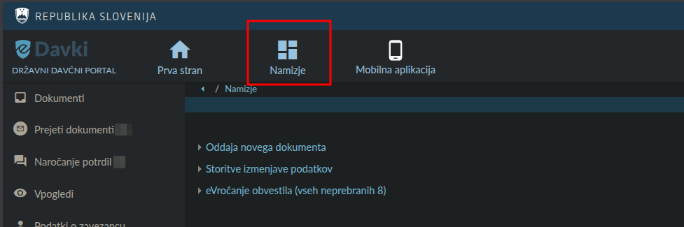
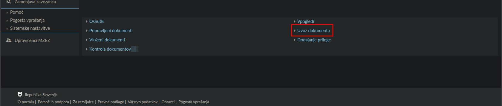
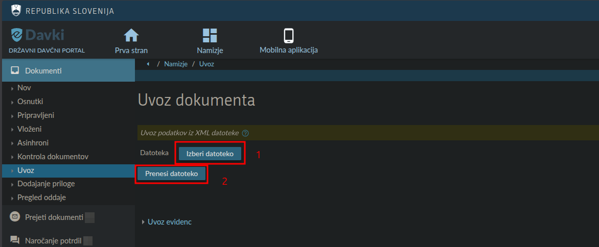
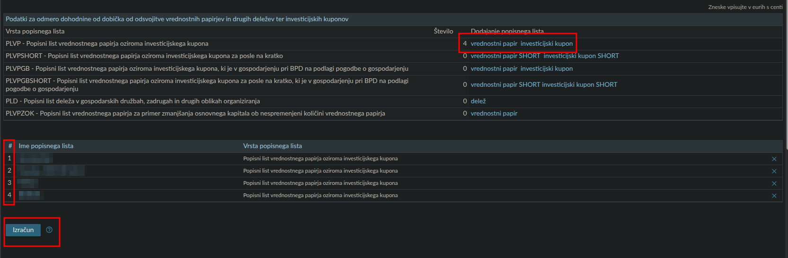
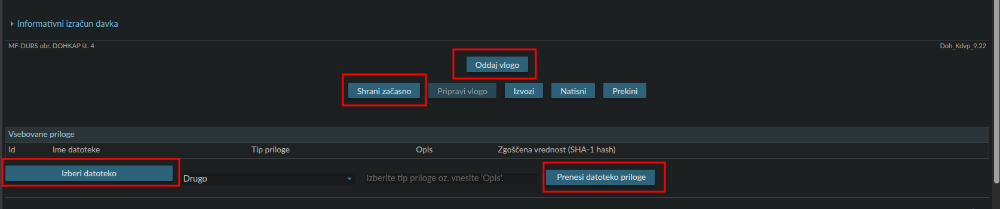
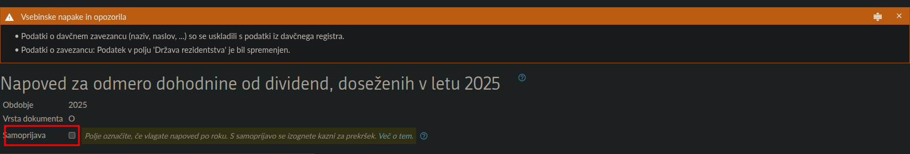
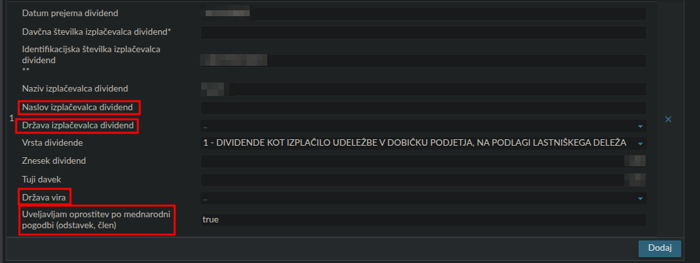
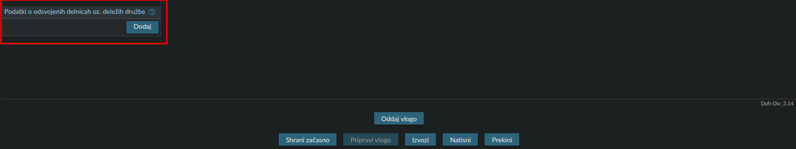

# eDavki Upload Guide

This guide will walk you through the process of importing your generated XML files into the FURS eDavki portal.

---

## 1. Accessing the Import Page

After logging into the eDavki desktop portal, you must navigate to the generic import section rather than opening a specific form.

**Step 1:** Locate the document entry point on your dashboard.

**Step 2:** Click on the **Import Document** (Uvoz dokumenta) option in the menu.

---

## 2. Uploading the XML File

Select the XML file generated by the **TaxBrokerReport** app.

**Step 3:** Click **Browse**, select your file, and confirm the upload.

---

## 3. Form Specific Instructions

### A. Capital Gains (Doh-KDVP)

**Step 4:** Upon a successful upload, you will see the KDVP data structure.

**Step 5:** Review the summary of all imported transactions.

> [!WARNING]
> **Important Note on FIFO and Multiple Brokers:**
> * **FIFO Rule**: FURS requires the "First-In, First-Out" method. This application generates data based strictly on your Trade Republic report.
> * **Multiple Brokers**: If you trade the **same ISIN** across multiple brokers (e.g., Revolut or IBKR), you cannot simply upload individual files. You must consolidate the data to ensure the FIFO sequence remains chronologically accurate across all accounts.
> * **Parser Logic**: We utilize the "Gains and Losses" section from the Trade Republic report where Buy/Sell pairs are already matched. This is optimal if you trade those specific assets exclusively on Trade Republic.
> * **Manual Correction Workflow**: If you need to add missing data or merge transactions, you can first generate a JSON file using the app's "JSON Mode," manually edit it, and then load the updated JSON instead of the PDF to generate the final XML. Detailed instructions can be found in the [JSON Data Format Manual](data-format.md).

**Step 6:** You can now save the report, upload additional proofs (PDF confirmations), or submit.

---

### B. Dividends (Doh-Div)

**Step 7:** Verify the imported dividend entries.

* **Self-Reporting**: If you are filing between Jan 1st and the last day of February, **uncheck** the "Self-reporting" (Samoprijava) box.

**Step 8:** Complete the missing Payer Data.

* **Manual Requirements**: You must manually enter the Payer's **Address**, **Country**, and **Source Country**.
* **Double Taxation**: If you are claiming a reduction based on tax already paid abroad, you must check the box for "Double Taxation Prevention."

**Step 9:** Proof of Tax Paid Abroad.

* If you claimed foreign tax credit, you **must** upload the official tax statement from your broker as an attachment.

---

### C. Deposit Interests (Doh-DHO)

**Step 10:** Verify the interest data import.

**Step 11:** Review interest amounts.

* **€1000 Threshold**: You only need to submit this form if your total (deposits) interest from all "EU-based" banks (Trade Republic, N26, etc.) exceeds **€1000** in the tax year.
* **Consolidation**: If you have interests from other banks (like N26), remember to add them to this report (click add record).

---

## ⚖️ Final Responsibility

The XML file is a tool to save you time. However, the legal responsibility for the accuracy of the data (and the manual addition of Payer info for dividends) rests entirely with the user.